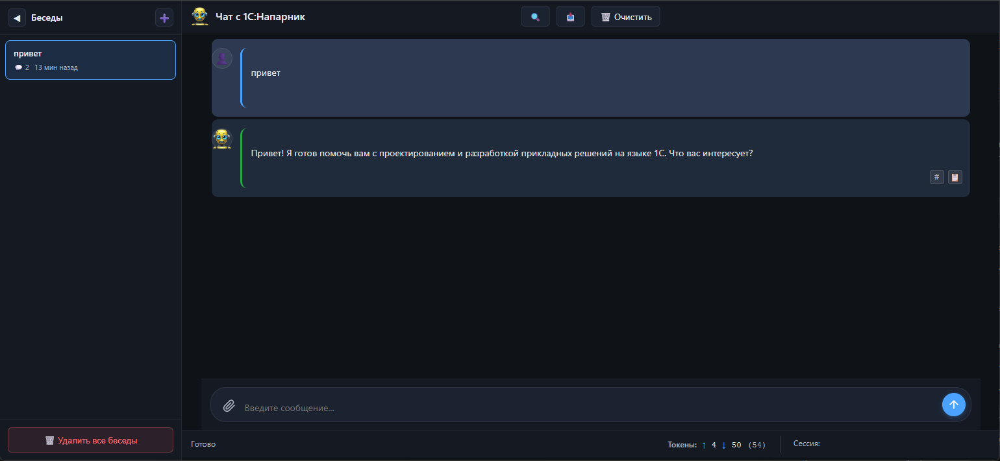

# 1C Buddy - Чат, MCP сервер и OpenAI совместимый API шлюз для общения с 1С:Напарник

## Возможности

### 💬 Веб-интерфейс чата
- Современный, адаптивный интерфейс чата
- Управление историей разговоров с изолированными контекстами (история хранится локально в браузере)
- Подсветка синтаксиса для кода 1C (BSL) и XML с автоопределением
- Прикрепление файлов (.bsl, .xml, .txt)
- Просмотр содержимого прикрепленных файлов в браузере
- Поиск по содержимому прикрепленных файлов
- Визуализация mermaid диаграмм с возможностью сохранить в png 
- Поиск по истории сообщений
- Экспорт истории разговоров в JSON
- Отображение статистики токенов (входящие/исходящие/всего)
- Копирование сообщений в буфер обмена
- Контекстное меню форматирования кода с горячими клавишами



### 🔧 MCP сервер
- Доступные инструменты:
  - `ask_1c_ai` - Общие вопросы и советы по 1C:Предприятие
  - `explain_1c_syntax` - Объяснение конкретных объектов/синтаксиса 1C с контекстом
  - `check_1c_code` - Проверка и валидация кода на ошибки (syntax/logic/performance)

### 🚀 OpenAI-совместимый API
- Полная совместимость с API OpenAI Chat Completions (`/v1/chat/completions`)
- Потоковые и непотоковые ответы с поддержкой Server-Sent Events (SSE)
- Стандартная аутентификация с Bearer токенами


## Быстрый старт

1. **Получите токен code.1c.ai** с сайта [code.1c.ai](https://code.1c.ai)


2. **Запустите с Docker:**
   ```bash
   docker pull roctup/1c-buddy
   
   docker run -d --name 1c-buddy --restart unless-stopped -p 6002:6002 -e "ONEC_AI_TOKEN=<your_1c_ai_token>" roctup/1c-buddy 
   ```
   
   Если нужен также OpenAI API шлюз:
   
   ```bash
   docker pull roctup/1c-buddy
   
   docker run -d --name 1c-buddy --restart unless-stopped -p 6002:6002 -e "ONEC_AI_TOKEN=<your_1c_ai_token>" -e "OPENAI_COMPAT_API_KEY=<your_custom_api_key>" roctup/1c-buddy 
   ```
   

3. **Начните общение:**
   - Веб-интерфейс чата: http://localhost:6002/chat

4. **Настройте MCP для IDE:**
    ```bash
    {
      "mcpServers": {   
        "1c-buddy-mcp": {
          "url": "http://localhost:6002/mcp",
          "connection_id": "1c_buddy_service_001",
          "alwaysAllow": [],
          "type": "streamable-http",
          "timeout": 300,
          "disabled": false
       }
     }
   }
    ```

5.  **Отправляйте запросы по OpenAI API:**

    Используйте любой OpenAI SDK или клиентскую библиотеку:
	
  	```python
  	from openai import OpenAI
  
  	client = OpenAI(
  		base_url="http://localhost:6002/v1",
  		api_key="your_custom_api_key"
  	)
  
  	# Непотоковый режим
  	response = client.chat.completions.create(
  		model="1c-buddy",
  		messages=[{"role": "user", "content": "Как создать HTTPСоединение в 1С?"}]
  	)
  	print(response.choices[0].message.content)
  
  	# Потоковый режим
  	for chunk in client.chat.completions.stream(
  		model="1c-buddy",
  		messages=[{"role": "user", "content": "Объясни объект Запрос"}]
  	):
  		print(chunk.choices[0].delta.content, end="")
  	```


## Благодарности

Огромное спасибо автору оригинального проекта MCP сервера для 1С:Напарник: **[artesk/1copilot_MCP](https://github.com/artesk/1copilot_MCP)** 

