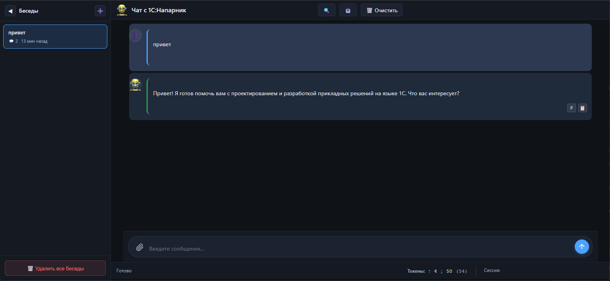

# 1C Buddy - Чат, MCP сервер и OpenAI совместимый API шлюз для общения с 1С:Напарник

## Возможности

### 💬 Веб-интерфейс чата
- Современный, адаптивный интерфейс чата
- Управление историей разговоров с изолированными контекстами (история хранится локально в браузере)
- Ответы в реальном времени с потоковой передачей
- Отдельное отображение tool call / tool result / follow-up блоков
- Отображение reasoning-дельт в процессе генерации
- Подсветка синтаксиса для кода 1C (BSL) и XML с автоопределением
- Прикрепление файлов (.bsl, .xml, .txt)
- Просмотр содержимого прикрепленных файлов в браузере
- Поиск по содержимому прикрепленных файлов
- Визуализация mermaid диаграмм с возможностью сохранить в png 
- Поиск по истории сообщений
- Экспорт истории разговоров в JSON
- Отображение статистики токенов (входящие/исходящие/всего)
- Копирование сообщений в буфер обмена
- Контекстное меню форматирования кода с горячими клавишами



### 🔧 MCP сервер
- Доступные инструменты:
  - `ask_1c_ai` - общие вопросы по платформе 1С и практическим сценариям
  - `explain_1c_syntax` - объяснение конкретного объекта, метода или конструкции 1С
  - `check_1c_code` - синтаксическая проверка или code review фрагмента кода 1С
  - `modify_1c_code` - изменение кода 1С по явному заданию пользователя
  - `search_1c_documentation` - поиск по документации платформы 1С:Предприятие
  - `search_its` - поиск по базе знаний ИТС
  - `fetch_its` - получение содержимого конкретного документа или раздела ИТС по `id`
  - `diff_1c_documentation_versions` - сравнение документации платформы между двумя версиями

### 🚀 OpenAI-совместимый API
- OpenAI-совместимый формат для `/v1/models` и `/v1/chat/completions`
- Потоковые и непотоковые ответы с поддержкой Server-Sent Events (SSE)
- Стандартная аутентификация с Bearer токенами


## Быстрый старт

1. **Получите токен code.1c.ai** с сайта [code.1c.ai](https://code.1c.ai)


2. **Запустите с Docker:**
   ```bash
   docker pull roctup/1c-buddy
   
   docker run -d --name 1c-buddy --restart unless-stopped -p 6002:6002 -e "ONEC_AI_TOKEN=<your_1c_ai_token>" roctup/1c-buddy 
   ```

   Если нужно зафиксировать версию БСП по умолчанию для MCP-запросов:

   ```bash
   docker run -d --name 1c-buddy --restart unless-stopped -p 6002:6002 -e "ONEC_AI_TOKEN=<your_1c_ai_token>" -e "DEFAULT_BSP_VERSION=3.2.1" roctup/1c-buddy
   ```
   
   Если нужен также OpenAI API шлюз:
   
   ```bash
   docker pull roctup/1c-buddy
   
   docker run -d --name 1c-buddy --restart unless-stopped -p 6002:6002 -e "ONEC_AI_TOKEN=<your_1c_ai_token>" -e "OPENAI_COMPAT_API_KEY=<your_custom_api_key>" roctup/1c-buddy 
   ```
   

3. **Начните общение:**
   - Веб-интерфейс чата: http://localhost:6002/chat

4. **Настройте MCP для IDE:**
    ```bash
    {
      "mcpServers": {   
        "onec-buddy-mcp": {
          "url": "http://localhost:6002/mcp",
          "connection_id": "1c_buddy_service_001",
          "alwaysAllow": [],
          "type": "streamable-http",
          "timeout": 300,
          "disabled": false
       }
     }
   }
    ```

5.  **Отправляйте запросы по OpenAI API:**

    Используйте любой OpenAI SDK или клиентскую библиотеку:
	
  	```python
  	from openai import OpenAI
  
  	client = OpenAI(
  		base_url="http://localhost:6002/v1",
  		api_key="your_custom_api_key"
  	)
  
  	# Непотоковый режим
  	response = client.chat.completions.create(
  		model="1c-buddy",
  		messages=[{"role": "user", "content": "Как создать HTTPСоединение в 1С?"}]
  	)
  	print(response.choices[0].message.content)
  
  	# Потоковый режим
  	for chunk in client.chat.completions.stream(
  		model="1c-buddy",
  		messages=[{"role": "user", "content": "Объясни объект Запрос"}]
  	):
  		print(chunk.choices[0].delta.content, end="")
  	```


## Благодарности

Огромное спасибо автору оригинального проекта MCP сервера для 1С:Напарник: **[artesk/1copilot_MCP](https://github.com/artesk/1copilot_MCP)** 
